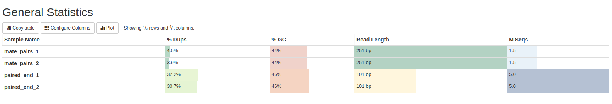
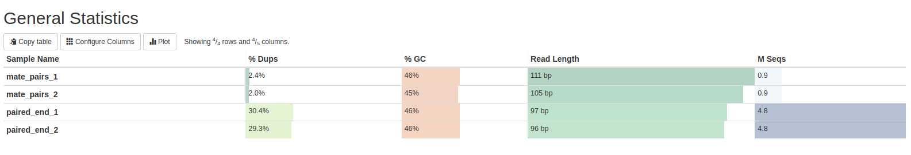

# Домашнее задание #1

## Обязательная часть

Запустил на сервере скрипт [`src/run.sh`](src/run.sh).
Полученные файлы скопировал к себе и запустил на них [`src/task.ipynb`](src/task.ipynb).
См. код в этих файлах, решение подробно расписано там в комментариях

#### Статистика для исходных чтений

#### Статистика для подрезанных чтений

[Здесь](data/multiqc_report_initial.html) лежит полный отчет для исходных чтений,
а [тут](data/multiqc_report_trimmed.html) -- для подрезанных чтений
